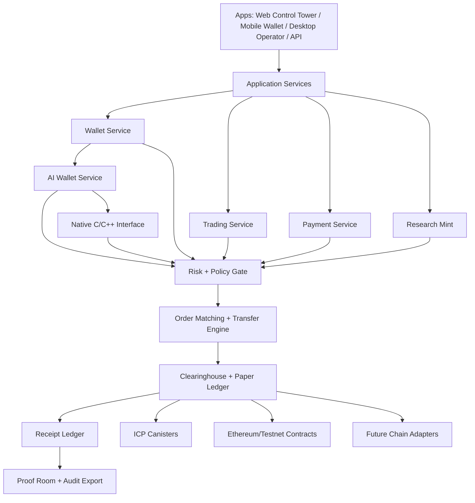

<div align="center">

<picture>
  <source media="(prefers-color-scheme: dark)" srcset="assets/parallax-logo.svg">
  <source media="(prefers-color-scheme: light)" srcset="assets/parallax-logo-dark.svg">
  
</picture>

<br />

[](https://github.com/ItsNotAILABS/PARALLAX-Exchange-Clearinghouse/actions/workflows/ci.yml)
[](https://internetcomputer.org/)
[](contracts/)
[](https://react.dev/)
[](https://www.typescriptlang.org/)
[](docs/NATIVE_CPP_INTERFACE.md)
[](docs/ALPHA_SERVICE_RUNWAY.md)
[](docs/AI_WALLET_ALPHA.md)
[](research/)

# PARALLAX

### AI-native financial infrastructure for wallets, trading, clearing, settlement receipts, and governed multi-ledger execution.

[Platform Blueprint](docs/PARALLAX_PLATFORM_SURFACE.md) · [Native C/C++ Interface](docs/NATIVE_CPP_INTERFACE.md) · [AI Wallet Alpha](docs/AI_WALLET_ALPHA.md) · [Alpha Service Runway](docs/ALPHA_SERVICE_RUNWAY.md) · [Architecture](#platform-architecture) · [Deployment Posture](#deployment-posture)

</div>

---

<div align="center">
  
</div>

---

## What PARALLAX is

**PARALLAX** is a product surface for building a paper-first, proof-forward financial operating system. The platform combines wallet operations, simulated trading, risk-gated execution, clearinghouse receipts, payment flows, research minting, AI-agent wallets, native C/C++ strategy interfaces, and operator governance into one coherent stack.

The current posture is intentionally conservative: **paper trading, testnet contracts, simulated balances, and receipt-backed proof flows first**. Live money movement, live broker execution, custody, regulated exchange activity, and fund operations require separate legal, security, compliance, and operational readiness gates.

## Product surfaces

| Surface | Role | First usable capability |
|---|---|---|
| **Wallet** | Identity, accounts, balances, AI-agent wallets, keys, ledger views | Internet Identity, paper/testnet balances, and policy-gated AI wallets |
| **Native Interface** | C ABI and C++ wrapper for strategy/runtime workers | Buildable AI-wallet policy evaluation outside Node.js |
| **Trade** | Order ticket, books, fills, market views | Paper order entry into a real backend contract |
| **Clearinghouse** | Matching, netting, settlement records | Fill and settlement receipt generation |
| **Pay** | Transfers, requests, invoices, remittance workflows | Internal paper transfer with receipt trail |
| **AI Execution** | Signals, strategy proposals, guarded automation | Signal cards that require operator approval |
| **Research Mint** | Papers, benchmarks, artifact records | Research metadata to proof artifact receipt |
| **Proof Room** | Audit exports, release manifests, Merkle records | Query and export receipts |
| **Governance** | Roles, policies, emergency halt, upgrade posture | Admin halt/resume and role-gated actions |

## Native C/C++ interface

PARALLAX now includes a standalone native interface for the AI wallet policy engine:

```text
src/native/ai-wallet/
```

It includes:

- stable C ABI: `include/parallax/ai_wallet.h`,
- modern C++17 wrapper: `include/parallax/ai_wallet.hpp`,
- C implementation: `src/ai_wallet.c`,
- CMake build and install targets,
- C and C++ tests,
- C++ demo executable.

Run the native gate:

```bash
pnpm native:configure
pnpm native:build
pnpm native:test
pnpm alpha:native
```

## AI wallet alpha

PARALLAX includes a dedicated AI wallet domain package:

```text
src/ai-wallet/        @parallax/ai-wallet
```

The AI wallet gives approved agents policy-gated paper/testnet wallets. It supports deterministic wallet creation, command evaluation, human approval thresholds, asset/counterparty allowlists, daily notional limits, receipt creation, and live-mode blocking.

Run the wallet gate:

```bash
pnpm alpha:wallet
```

Core exports:

- `createAiWallet`
- `createPaperOrderCommand`
- `createInternalTransferCommand`
- `createResearchMintCommand`
- `evaluateAiWalletCommand`
- `createAiWalletCreatedReceipt`
- `createAiWalletEvaluationReceipt`
- `verifyAiWalletReceiptChain`

## Alpha service system

The alpha platform is represented by service manifests, frontend registries, native packages, and validation gates:

| Artifact | Purpose |
|---|---|
| `config/services/parallax.alpha.services.json` | source-of-truth alpha service catalog |
| `config/services/parallax.ai-wallet.service.json` | AI wallet service contract manifest |
| `src/ai-wallet/` | policy-gated AI wallet TypeScript package |
| `src/native/ai-wallet/` | polished C/C++ AI wallet interface package |
| `src/frontend/src/config/parallaxAlphaServices.ts` | frontend-ready service registry and readiness helpers |
| `scripts/validate-alpha-services.mjs` | manifest validator for services, dependencies, gates, and boundaries |
| `docs/ALPHA_SERVICE_RUNWAY.md` | operator build order and alpha readiness rubric |
| `docs/AI_WALLET_ALPHA.md` | AI wallet operator guide and integration gates |
| `docs/NATIVE_CPP_INTERFACE.md` | native C/C++ build and usage guide |

Run the alpha gates:

```bash
pnpm alpha:validate
pnpm alpha:wallet
pnpm alpha:native
pnpm alpha:gate
```

## Platform architecture



## First vertical slice

Build one undeniable product loop before expanding the system:

```text
Wallet Login -> AI Wallet Policy -> Native/TS Command Evaluation -> Paper Order -> Risk Gate -> Match -> Settle -> Receipt -> Proof Export
```

Acceptance criteria:

- user signs in with an identity provider,
- paper balance is visible,
- AI wallet has explicit paper/testnet policy,
- AI command evaluates before execution,
- native C/C++ command evaluation matches the alpha wallet boundary,
- human approval is required above threshold,
- order ticket submits to the backend contract,
- halted pairs reject orders,
- accepted orders emit receipts,
- matched orders emit settlement receipts,
- receipts survive reload,
- operator can export proof records,
- tests cover invalid orders, duplicate orders, unauthorized halt, halted pair rejection, full fills, partial fills, AI wallet live-mode rejection, native live-mode rejection, and receipt pagination.

## Runtime stack

| Layer | Current trunk | Expansion path |
|---|---|---|
| Frontend | React, TypeScript, Vite | mobile wallet, desktop operator, SDK app shells |
| Backend authority | ICP/Motoko canisters | additional canisters by surface and domain |
| AI wallet domain | `@parallax/ai-wallet` TypeScript package | canister persistence and frontend Control Tower tab |
| Native strategy/runtime interface | C ABI and C++17 wrapper | strategy workers, simulations, low-latency policy checks |
| Contract interface | Candid | generated bindings and typed SDKs |
| External contracts | Solidity/Ethereum testnet contracts | guarded adapters and chain-specific modules |
| Data/proof | append-only receipt records | Merkle roots, export bundles, audit manifests |
| Operators | local Docker and developer workflows | Cloudflare, observability, release gates |
| AI workers | research and simulation modules | isolated strategy workers with no direct live execution |

## Repository map

```text
apps/        product applications: web, mobile, desktop, operator surfaces
canisters/   ICP/Motoko authority, wallet, clearinghouse, ledger modules
contracts/   Ethereum/testnet contracts and external chain adapters
packages/    shared SDK, UI, types, receipts, policy libraries
src/ai-wallet/ policy-gated AI wallet package for agents
src/native/ai-wallet/ C ABI, C++ wrapper, CMake build, native tests
services/    API, wallet, payment, risk, clearing, indexing services
workers/     strategy, simulation, benchmark, research, and indexing jobs
docs/        architecture, deployment, operator, protocol, and product docs
infra/       Docker, CI, Cloudflare, observability, deployment definitions
research/    whitepapers, charters, benchmark reports, release packets
```

## Contracts and command families

Every user or machine action should be represented by an explicit contract object before execution.

| Contract | Purpose |
|---|---|
| `parallax_aiw_wallet` | native C wallet struct assigned to an AI agent |
| `parallax_aiw_command` | native C proposed AI wallet action |
| `parallax_aiw_evaluation` | native C approve/reject/human-approval decision |
| `parallax_aiw_receipt` | native C receipt proof record |
| `AiWallet` | wallet assigned to an AI agent |
| `AiWalletPolicy` | scopes, limits, modes, assets, counterparties, approvals |
| `AiWalletCommand` | proposed AI wallet action before execution |
| `AiWalletPolicyEvaluation` | approve/reject/human-approval decision with reason codes |
| `AiWalletReceipt` | wallet creation/evaluation/action proof record |
| `WalletCommand` | account, identity, and balance operations |
| `TransferCommand` | internal transfer and payment intent |
| `OrderCommand` | paper/testnet order entry |
| `RiskDecision` | accepted/rejected decision with reason codes |
| `FillReceipt` | matched order record |
| `SettlementReceipt` | clearing and ledger record |
| `OperatorActionReceipt` | halt, resume, role, and policy actions |
| `ResearchArtifactReceipt` | paper, benchmark, and artifact minting record |
| `GovernancePolicy` | role, mode, and system boundary rules |
| `SystemMode` | local, paper, testnet, restricted-live, live |

## Deployment posture

| Stage | Description | Allowed actions |
|---|---|---|
| **Local** | developer machine and local canisters | paper orders, fixtures, local receipts, AI wallet tests, native C/C++ tests |
| **Testnet** | public test canisters and external testnet contracts | testnet assets, demos, proof exports, policy-gated AI wallets |
| **Closed alpha** | controlled users and operator review | paper trading, testnet transfers, research receipts, AI signal approval |
| **Production candidate** | security, legal, compliance, native build matrix, and observability gate | no live funds without external validation |
| **Live** | regulated, audited, monitored, insured posture | only after complete readiness review |

## Development

```bash
git clone https://github.com/ItsNotAILABS/PARALLAX-Exchange-Clearinghouse.git
cd PARALLAX-Exchange-Clearinghouse
pnpm install
pnpm alpha:validate
pnpm alpha:wallet
pnpm alpha:native
pnpm run dev
```

Docker path:

```bash
docker compose up
```

Native path:

```bash
cmake -S src/native/ai-wallet -B build/native/ai-wallet
cmake --build build/native/ai-wallet
ctest --test-dir build/native/ai-wallet --output-on-failure
```

Test path:

```bash
pnpm alpha:validate
pnpm alpha:wallet
pnpm alpha:native
pnpm typecheck
pnpm test
```

> The exact commands may differ by package boundary as the monorepo is consolidated. Treat failing tests as the highest-priority product gate before adding live surfaces.

## Documentation

- [Native C/C++ Interface](docs/NATIVE_CPP_INTERFACE.md)
- [AI Wallet Alpha](docs/AI_WALLET_ALPHA.md)
- [Alpha Service Runway](docs/ALPHA_SERVICE_RUNWAY.md)
- [Platform Surface Blueprint](docs/PARALLAX_PLATFORM_SURFACE.md)
- [Product Architecture](docs/PRODUCT_ARCHITECTURE.md)
- [Platform Federation](docs/PARALLAX_PLATFORM_FEDERATION.md)
- [Launch Packet](docs/PARALLAX_MAJOR_RUN.md)
- [Alpha Service Catalog](config/services/parallax.alpha.services.json)
- [AI Wallet Service Manifest](config/services/parallax.ai-wallet.service.json)
- [Token Registry](config/tokens/parallax.tokens.json)

## Public language boundary

Use precise language:

- AI-native financial infrastructure,
- paper-first trading surface,
- AI-agent wallet policy engine,
- native C/C++ policy interface,
- multi-ledger wallet architecture,
- receipt-backed settlement research,
- testnet-ready platform,
- governed execution layer.

Avoid unproven claims:

- guaranteed settlement,
- live HFT fund,
- production bank replacement,
- risk-free trading,
- externally audited status,
- real money movement,
- autonomous live AI trading.

## Near-term roadmap

1. **Native Worker Gate**: use the C/C++ interface inside strategy workers and simulation processes.
2. **AI Wallet Backend Gate**: persist AI wallets, policies, commands, evaluations, receipts, and daily usage in canisters.
3. **Alpha Ops Control Tower**: render service readiness, gates, dependencies, blocked live actions, native readiness, and AI wallet readiness.
4. **Control Tower MVP**: wallet login, AI wallet policy, paper balances, paper order, risk gate, fill receipt, proof export.
5. **Wallet + Pay MVP**: internal transfer command, simulated ledger, payment receipt, account history.
6. **Testnet contracts**: token registry, Solidity testnet deployment scripts, ICP canister interfaces.
7. **Proof Room**: receipt search, export bundles, Merkle root generation, release manifests.
8. **Research Mint**: paper metadata, benchmark packet records, artifact receipts.
9. **Operator governance**: role policy, emergency halt, upgrade checklist, compliance boundary.

## Status

PARALLAX is being consolidated into a real alpha platform. The immediate priority is to turn the existing research and code surfaces into service-gated app loops with tests, receipts, health status, operator controls, native C/C++ policy enforcement, AI-wallet policy enforcement, and clear deployment boundaries.
