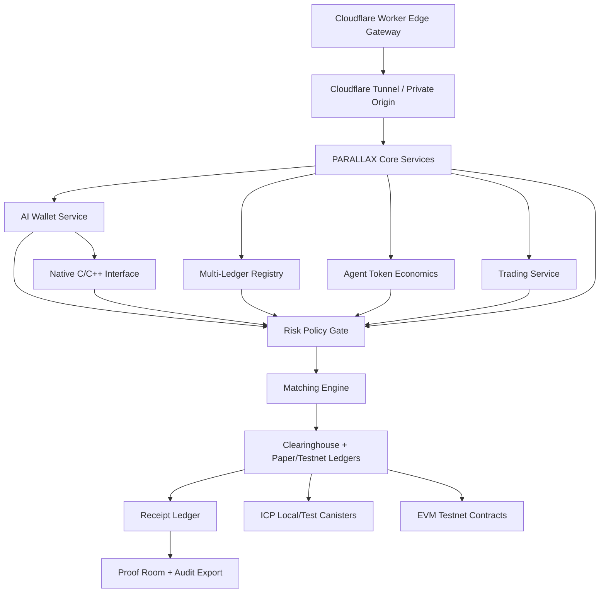

<div align="center">

<picture>
  <source media="(prefers-color-scheme: dark)" srcset="assets/parallax-logo.svg">
  <source media="(prefers-color-scheme: light)" srcset="assets/parallax-logo-dark.svg">
  
</picture>

<br />

[](https://github.com/ItsNotAILABS/PARALLAX-Exchange-Clearinghouse/actions/workflows/ci.yml)
[](https://internetcomputer.org/)
[](contracts/)
[](https://react.dev/)
[](https://www.typescriptlang.org/)
[](docs/CLOUDFLARE_EDGE_RUNWAY.md)
[](docs/NATIVE_CPP_INTERFACE.md)
[](docs/ALPHA_SERVICE_RUNWAY.md)
[](docs/AI_WALLET_ALPHA.md)
[](research/)

# PARALLAX

### AI-native financial infrastructure for multi-ledger agents, token economics, trading, clearing, settlement receipts, and governed edge execution.

[Platform Blueprint](docs/PARALLAX_PLATFORM_SURFACE.md) · [Cloudflare Edge](docs/CLOUDFLARE_EDGE_RUNWAY.md) · [Multi-Ledger Ecosystem](docs/MULTI_LEDGER_ECOSYSTEM.md) · [Agent Token Economics](docs/AGENT_TOKEN_ECONOMICS.md) · [Showcase Gate](docs/PRODUCT_SHOWCASE_GATE.md) · [Native C/C++ Interface](docs/NATIVE_CPP_INTERFACE.md)

</div>

---

<div align="center">
  
</div>

---

## What PARALLAX is

**PARALLAX** is a paper-first, proof-forward financial operating system for AI agents. The platform combines multi-ledger registries, token-economics policy, AI-agent wallets, simulated trading, risk-gated execution, clearinghouse receipts, Cloudflare edge access, native C/C++ strategy interfaces, and operator governance into one coherent alpha product.

The current posture is intentionally conservative: **paper trading, testnet contracts, simulated balances, internal credits, and receipt-backed proof flows first**. Live money movement, live broker execution, custody, regulated exchange activity, and fund operations require separate legal, security, compliance, and operational readiness gates.

## Product surfaces

| Surface | Role | First usable capability |
|---|---|---|
| **Cloudflare Edge Gateway** | Worker API, auth guard, CORS, tunnel proxy | `/health`, ledger registry, token registry, agent-command precheck |
| **Multi-Ledger Registry** | Paper, ICP local/test, EVM testnet, agent-credit ledgers | Source-of-truth ledger manifest |
| **Agent Token Economics** | PXUSD, PXICP, PXETH, PXAI, PXGPU, PXCRED | Internal/testnet token class registry |
| **Wallet** | Identity, accounts, balances, AI-agent wallets, keys, ledger views | Internet Identity, paper/testnet balances, policy-gated AI wallets |
| **Native Interface** | C ABI and C++ wrapper for strategy/runtime workers | Buildable AI-wallet policy evaluation outside Node.js |
| **Trade** | Order ticket, books, fills, market views | Paper order entry into a backend contract |
| **Clearinghouse** | Matching, netting, settlement records | Fill and settlement receipt generation |
| **Pay** | Transfers, requests, invoices, remittance workflows | Internal paper transfer with receipt trail |
| **AI Execution** | Signals, strategy proposals, guarded automation | Signal cards that require operator approval |
| **Research Mint** | Papers, benchmarks, artifact records | Research metadata to proof artifact receipt |
| **Proof Room** | Audit exports, release manifests, Merkle records | Query and export receipts |
| **Governance** | Roles, policies, emergency halt, upgrade posture | Admin halt/resume and role-gated actions |

## Cloudflare edge layer

PARALLAX now includes a Cloudflare Worker gateway package:

```text
apps/cloudflare-gateway/
```

Routes:

| Route | Method | Purpose |
|---|---:|---|
| `/health` | GET | gateway health, alpha gates, expected tunnel host |
| `/v1/ledgers` | GET | multi-ledger registry |
| `/v1/tokens` | GET | token class registry |
| `/v1/agents/classes` | GET | AI-agent wallet classes |
| `/v1/alpha/gates` | GET | alpha safety gates |
| `/v1/agent-command/evaluate` | POST | edge-side policy precheck for AI-agent commands |
| `/v1/proxy/*` | any | guarded proxy to PARALLAX core origin through tunnel/private origin |

Run the edge gateway locally:

```bash
pnpm edge:dev
```

Deploy when Cloudflare account, zone, token, and route are configured:

```bash
pnpm edge:deploy
```

## Multi-ledger ecosystem

Source of truth:

```text
config/ledgers/parallax.multiledger.ecosystem.json
```

Ledgers:

| Ledger | Mode | Purpose |
|---|---:|---|
| `parallax-paper-ledger` | paper | simulated balances, orders, transfers, and alpha settlement receipts |
| `icp-local-ledger` | testnet | ICP local/test canister integration |
| `ethereum-testnet-ledger` | testnet | EVM testnet contract and adapter experiments |
| `agent-credit-ledger` | paper | internal credits for agent work, compute, research, and proof artifacts |

## Agent token economics

Source of truth:

```text
config/tokenomics/parallax.agent-tokenomics.json
```

Token classes:

| Symbol | Class | Mode |
|---|---|---:|
| `PXUSD` | paper stable unit | paper |
| `PXICP` | ICP test unit | testnet |
| `PXETH` | EVM test unit | testnet |
| `PXAI` | agent work credit | paper |
| `PXGPU` | compute credit | paper |
| `PXCRED` | receipt credit | paper |

## Cloudflare Tunnel

Templates:

```text
infra/cloudflare/tunnel/config.example.yml
infra/cloudflare/tunnel/docker-compose.tunnel.yml
```

The intended path:

```text
Cloudflare Worker
-> authenticated edge route
-> Cloudflare Tunnel / private origin
-> PARALLAX core service
-> receipt ledger
```

Do not commit tunnel credentials. Real tunnel deployment requires your Cloudflare account, tunnel id, credentials file, zone, and chosen hostnames.

## Native C/C++ interface

PARALLAX includes a standalone native interface for the AI wallet policy engine:

```text
src/native/ai-wallet/
```

It includes:

- stable C ABI: `include/parallax/ai_wallet.h`,
- modern C++17 wrapper: `include/parallax/ai_wallet.hpp`,
- C implementation: `src/ai_wallet.c`,
- CMake build and install targets,
- C and C++ tests,
- C++ demo executable.

Run the native gate:

```bash
pnpm alpha:native
```

## AI wallet alpha

PARALLAX includes a dedicated AI wallet domain package:

```text
src/ai-wallet/        @parallax/ai-wallet
```

The AI wallet gives approved agents policy-gated paper/testnet wallets. It supports deterministic wallet creation, command evaluation, human approval thresholds, asset/counterparty allowlists, daily notional limits, receipt creation, and live-mode blocking.

Run the wallet gate:

```bash
pnpm alpha:wallet
```

## Product validation

Run the product gate:

```bash
pnpm product:validate
pnpm alpha:product
```

Full alpha validation path:

```bash
pnpm alpha:validate
pnpm alpha:wallet
pnpm alpha:native
pnpm alpha:product
pnpm alpha:gate
```

## Platform architecture



## First showcase loop

```text
Cloudflare Worker Health
-> Ledger Registry
-> Token Registry
-> AI-Agent Wallet Class
-> Edge Command Evaluation
-> Tunnel/Core Route
-> Paper/Testnet Settlement
-> Receipt Export
```

Showcase-ready means this works through a deployed Worker, verified tunnel, Control Tower UI, and receipt-visible command flow.

## Repository map

```text
apps/cloudflare-gateway/ Cloudflare Worker gateway and Wrangler config
config/ledgers/          multi-ledger ecosystem manifest
config/tokenomics/       AI-agent token economics manifest
infra/cloudflare/        tunnel templates and Cloudflare runbooks
src/ai-wallet/           policy-gated AI wallet package for agents
src/native/ai-wallet/    C ABI, C++ wrapper, CMake build, native tests
docs/                    architecture, deployment, operator, protocol, and product docs
```

## Contracts and command families

Every user, agent, or machine action should be represented by an explicit contract object before execution.

| Contract | Purpose |
|---|---|
| `LedgerRegistryEntry` | ledger id, mode, assets, authority, and safety boundary |
| `TokenClass` | token symbol, class, mode, value claim, and transfer boundary |
| `AgentWalletClass` | AI-agent wallet capability and ledger policy |
| `EdgePolicyDecision` | Worker-side approve/reject/human-review decision |
| `CloudflareTunnelRoute` | hostname to private origin mapping |
| `parallax_aiw_wallet` | native C wallet struct assigned to an AI agent |
| `parallax_aiw_command` | native C proposed AI wallet action |
| `parallax_aiw_evaluation` | native C approve/reject/human-approval decision |
| `parallax_aiw_receipt` | native C receipt proof record |
| `AiWallet` | wallet assigned to an AI agent |
| `AiWalletPolicy` | scopes, limits, modes, assets, counterparties, approvals |
| `AiWalletCommand` | proposed AI wallet action before execution |
| `AiWalletReceipt` | wallet creation/evaluation/action proof record |
| `FillReceipt` | matched order record |
| `SettlementReceipt` | clearing and ledger record |
| `ResearchArtifactReceipt` | paper, benchmark, and artifact minting record |
| `GovernancePolicy` | role, mode, and system boundary rules |
| `SystemMode` | local, paper, testnet, restricted-live, live |

## Deployment posture

| Stage | Description | Allowed actions |
|---|---|---|
| **Local** | developer machine and local canisters | paper orders, fixtures, local receipts, native tests, Worker dev |
| **Edge preview** | Cloudflare Worker preview/dev route | health, registry reads, authenticated alpha policy prechecks |
| **Testnet** | public test canisters and external testnet contracts | testnet assets, demos, proof exports, policy-gated AI wallets |
| **Closed alpha** | controlled users and operator review | paper trading, testnet transfers, research receipts, AI signal approval |
| **Production candidate** | security, legal, compliance, native build matrix, Cloudflare route, tunnel verification, observability gate | no live funds without external validation |
| **Live** | regulated, audited, monitored, insured posture | only after complete readiness review |

## Documentation

- [Cloudflare Edge Runway](docs/CLOUDFLARE_EDGE_RUNWAY.md)
- [Multi-Ledger Ecosystem](docs/MULTI_LEDGER_ECOSYSTEM.md)
- [Agent Token Economics](docs/AGENT_TOKEN_ECONOMICS.md)
- [Product Showcase Gate](docs/PRODUCT_SHOWCASE_GATE.md)
- [Native C/C++ Interface](docs/NATIVE_CPP_INTERFACE.md)
- [AI Wallet Alpha](docs/AI_WALLET_ALPHA.md)
- [Alpha Service Runway](docs/ALPHA_SERVICE_RUNWAY.md)
- [Platform Surface Blueprint](docs/PARALLAX_PLATFORM_SURFACE.md)
- [Product Architecture](docs/PRODUCT_ARCHITECTURE.md)
- [Platform Federation](docs/PARALLAX_PLATFORM_FEDERATION.md)
- [Launch Packet](docs/PARALLAX_MAJOR_RUN.md)
- [Alpha Service Catalog](config/services/parallax.alpha.services.json)
- [AI Wallet Service Manifest](config/services/parallax.ai-wallet.service.json)
- [Token Registry](config/tokens/parallax.tokens.json)

## Public language boundary

Use precise language:

- AI-native financial infrastructure,
- paper-first multi-ledger agent economy,
- Cloudflare edge gateway,
- AI-agent token economics,
- internal agent credits,
- testnet-ready platform,
- native C/C++ policy interface,
- receipt-backed settlement research,
- governed execution layer.

Avoid unproven claims:

- guaranteed settlement,
- live HFT fund,
- production bank replacement,
- no-risk trading,
- externally audited status,
- real money movement,
- unapproved live AI trading,
- public token sale,
- mainnet bridge.

## Near-term roadmap

1. **Cloudflare Deployment Gate**: deploy Worker preview/custom route and set `PARALLAX_EDGE_TOKEN`.
2. **Tunnel Verification Gate**: connect Cloudflare Tunnel to local/core service without exposing raw origin.
3. **Control Tower Edge Binding**: read ledgers, tokens, agent classes, and alpha gates from Worker routes.
4. **Receipt-Visible Command Loop**: POST edge command evaluation, route to core, emit receipt, show proof.
5. **Native Worker Gate**: use the C/C++ interface inside strategy workers and simulation processes.
6. **AI Wallet Backend Gate**: persist AI wallets, policies, commands, evaluations, receipts, and daily usage in canisters.
7. **Token Economics Gate**: issue/burn PXAI, PXGPU, and PXCRED only from receipt-backed internal events.
8. **Operator Governance**: role policy, emergency halt, upgrade checklist, compliance boundary.

## Status

PARALLAX is being consolidated into a real alpha product. The repo now has AI-wallet policy, native C/C++ policy enforcement, multi-ledger registry, AI-agent token economics, Cloudflare Worker gateway, tunnel templates, product validation, and showcase gates. It is not yet showcase-ready until the Worker is deployed, the tunnel is verified, the Control Tower consumes edge routes, and one receipt-visible paper/testnet command loop is working end-to-end.
