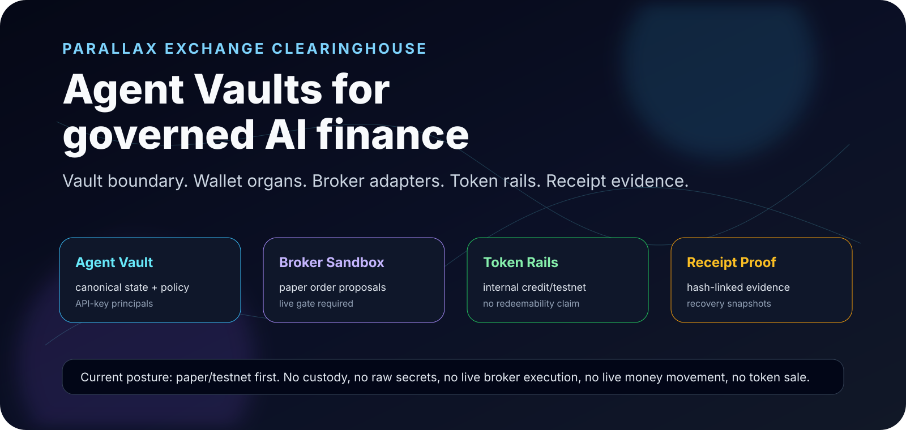

<div align="center">

<picture>
  <source media="(prefers-color-scheme: dark)" srcset="assets/parallax-logo.svg">
  <source media="(prefers-color-scheme: light)" srcset="assets/parallax-logo-dark.svg">
  
</picture>

<br />

[](https://github.com/ItsNotAILABS/PARALLAX-Exchange-Clearinghouse/actions/workflows/ci.yml)
[](https://github.com/ItsNotAILABS/PARALLAX-Exchange-Clearinghouse/actions/workflows/universal-launch.yml)
[](https://github.com/ItsNotAILABS/PARALLAX-Exchange-Clearinghouse/actions/workflows/trading-terminal.yml)
[](https://github.com/ItsNotAILABS/PARALLAX-Exchange-Clearinghouse/actions/workflows/sovereign-finance.yml)
[](https://github.com/ItsNotAILABS/PARALLAX-Exchange-Clearinghouse/actions/workflows/commercial-grade.yml)

[](https://github.com/ItsNotAILABS/PARALLAX-Exchange-Clearinghouse/commits/main)
[](https://github.com/ItsNotAILABS/PARALLAX-Exchange-Clearinghouse)
[](https://github.com/ItsNotAILABS/PARALLAX-Exchange-Clearinghouse)
[](LICENSE)
[](docs/OPERATOR_BOUNDARY_READINESS.md)
[](docs/LIVE_GATE_ENGINE.md)

# PARALLAX Exchange Clearinghouse

### Governed financial infrastructure for external AI-agent swarms.

**Agent Vaults are the jurisdictional boundary. Wallets are execution organs. User funding intents, broker adapters, internal token rails, and crypto purchase rails remain policy-gated. Receipts are the evidence layer.**

[Agent Vault API](docs/BACKGROUND_AGENTS_AGENT_API.md) · [Crypto User Funding](docs/CRYPTO_USER_FUNDING_RUNWAY.md) · [Vault Persistence Gate](docs/VAULT_PERSISTENCE_GATE.md) · [Operator Boundary](docs/OPERATOR_BOUNDARY_READINESS.md) · [Regulated-Live Readiness](docs/REGULATED_LIVE_READINESS.md) · [Live Gate Engine](docs/LIVE_GATE_ENGINE.md) · [Platform Federation](docs/PARALLAX_PLATFORM_FEDERATION.md)

</div>

---

<div align="center">
  
</div>

---

## Executive summary

**PARALLAX** is an AI-native financial operating layer for external agents, vaults, ledgers, user-funded purchase intents, broker-adapter readiness, internal token rails, clearinghouse receipts, and regulated-live approval workflows.

The platform is built around a simple production doctrine:

```text
Vault boundary -> user funding intent -> wallet execution -> policy gate -> broker/token/purchase proposal -> receipt evidence -> recovery proof
```

PARALLAX is currently **paper/testnet first**. It can register vaults, API-key principals, secret references, broker connector contracts, crypto funding intents, external provider session references, wallet-transfer references, funding confirmations, internal token rails, paper broker proposals, paper/testnet transfers, live approval packets, recovery snapshots, and hash-linked receipts.

It does **not** enable custody, raw private-key storage, seed capture, raw secret storage, live broker execution, live money movement, token sales, redeemability/yield claims, or public mainnet bridge execution.

---

## Current product surface

| Layer | What it does | Current state |
|---|---|---:|
| **Agent Vault API** | Creates vaults containing wallet systems, connector maps, ledgers, policy tools, billing meters, and receipts | Built |
| **Crypto User Funding** | Models external provider sessions, wallet-transfer references, confirmations, balance credit proposals, and purchase authorization receipts | Built |
| **Canonical Vault State** | Persists vaults, wallets, receipts, principals, recovery snapshots, and receipt heads | Built |
| **Boundary Gate** | Exposes `/api/boundaries` and denies unsafe capability paths | Built |
| **Regulated-Live Readiness** | Registers secret references, broker adapters, and token rails without enabling live regulated activity | Built |
| **Live Gate Engine** | Evaluates missing evidence and builds approval packets before any future manual live cutover | Built |
| **Cloudflare Edge Gateway** | Worker gateway and edge posture for API exposure | Built |
| **Native AI Wallet** | C/C++ policy interface for external strategy/runtime workers | Built |
| **Proof Room** | Receipt-first audit posture for agent, vault, transfer, funding, purchase, and approval events | Built |

---

## Operator boundaries

PARALLAX is deliberately gated. These rules are enforced in code, documentation, and validation receipts:

| Boundary | Status |
|---|---:|
| No custody | Enforced |
| No private keys | Enforced |
| No raw secret storage | Enforced |
| No live broker execution | Enforced |
| No live money movement | Enforced |
| No token sale | Enforced |
| No public mainnet bridge | Enforced |
| Paper/testnet only | Active posture |

Unsafe paths return a denial object such as:

```json
{
  "error": "regulated_live_gate_required",
  "posture": "regulated_live_disabled_until_approved"
}
```

---

## HD architecture view

<div align="center">
  
</div>

---

## API surface

### Agent Vaults

```text
GET  /api/vaults
POST /api/vaults
GET  /api/vaults/:id
POST /api/vaults/:id/connectors
POST /api/vaults/:id/agents
POST /api/vaults/:id/ledger/transfer
```

### Crypto user funding and purchases

```text
GET  /api/crypto/funding/policy
POST /api/crypto/funding/intents
POST /api/crypto/funding/confirmations
POST /api/crypto/purchases/authorize
GET  /api/crypto/funding/receipts
```

### Persistence, recovery, and proof

```text
GET /api/snapshot
GET /api/recovery
GET /api/receipts
```

### Boundaries and regulated-live readiness

```text
GET  /api/boundaries
GET  /api/regulated-live
GET  /api/live/gate
POST /api/live/approval-packet
```

### Secret references, broker adapters, and token rails

```text
GET  /api/secrets
POST /api/secrets
GET  /api/brokers
POST /api/brokers
GET  /api/brokers/adapters
POST /api/brokers/paper-order
GET  /api/token-rails
POST /api/token-rails
POST /api/token-rails/proposal
```

### Explicitly denied live routes

```text
POST /api/brokers/execute
POST /api/live/execute
POST /api/live-money/transfer
POST /api/token-sale
POST /api/token-rails/live-transfer
```

---

## Crypto funding flow

```text
user purchase intent
  -> quote and disclosures
  -> user consent
  -> funding intent
  -> provider session or wallet-transfer reference
  -> transaction/webhook observation
  -> confirmation
  -> KYC/AML and operator review if required
  -> balance credit proposal
  -> purchase authorization
  -> purchase receipt
  -> proof-room append
```

Runtime functions:

```text
getCryptoFundingPolicy()
createFundingIntent(input)
recordFundingConfirmation(input)
evaluatePurchaseAuthorization(input)
```

The runtime lives at:

```text
apps/crypto-funding-gateway/src/index.js
```

---

## Quick start

```bash
pnpm platform:dev
```

Open the local platform surface:

```text
http://localhost:8787/platform
```

Use the demo API key for local paper/testnet flows:

```text
Authorization: Bearer pk_demo_operator
```

Run the platform and crypto funding gates:

```bash
pnpm platform:validate
pnpm crypto:funding:validate
```

Full alpha path:

```bash
pnpm alpha:validate
pnpm alpha:wallet
pnpm alpha:platform
pnpm alpha:product
pnpm alpha:launch
```

---

## Validation receipts

PARALLAX emits explicit validation receipts under `dist/platform/`, `dist/commercial/`, and `dist/crypto/` when gates run:

```text
agent-vault-platform-validation-receipt.json
vault-persistence-gate-receipt.json
operator-boundary-readiness-receipt.json
regulated-live-readiness-receipt.json
live-gate-engine-receipt.json
crypto-user-funding-validation-receipt.json
```

These receipts exist to prove the repo has the expected architecture surfaces, gate terms, denial paths, crypto funding contracts, purchase authorization terms, and operator boundaries.

---

## Broker readiness families

PARALLAX models broker integration as adapter readiness until regulated-live gates are satisfied:

```text
alpaca_sandbox
interactive_brokers_paper
tradier_sandbox
schwab_developer_sandbox
tastytrade_sandbox
coinbase_sandbox
kraken_sandbox
binance_testnet
oanda_practice
dxtrade_demo
mt5_demo_bridge
```

The platform supports paper/sandbox broker proposal flows. It does not submit live broker orders.

---

## Internal token rails

Internal rails are modeled as credit/testnet units only:

| Symbol | Role | Current mode |
|---|---|---:|
| `PXUSD` | paper stable unit | paper/testnet |
| `PXAI` | agent work credit | internal credit |
| `PXCRED` | receipt credit | internal credit |
| `PXGPU` | compute credit | internal credit |
| `PXRCPT` | receipt proof unit | internal credit |

Disabled claims: cash redeemability, yield, deposit account behavior, security-token sale, and public mainnet value transfer.

---

## Live gate evidence

Future manual live cutover requires a complete evidence packet:

```text
legal_entity_verified
kyc_aml_program
broker_terms_review
licensed_operator_attestation
compliance_officer_attestation
production_secret_provider_bound
risk_limits_approved
human_approval_workflow
kill_switch_enabled
audit_log_enabled
receipt_chain_enabled
daily_reconciliation_job
incident_response_runbook
```

Until all gates are satisfied, live execution remains denied.

---

## Repository map

```text
apps/agent-api/                Agent Vault API, canonical state, regulated-live gate helpers
apps/crypto-funding-gateway/  Crypto funding intent, confirmation, and purchase authorization runtime
apps/universal-trading/        Browser platform surface and control plane
apps/cloudflare-gateway/       Cloudflare Worker gateway and Wrangler package
config/crypto/                 Crypto user funding and purchase rail configuration
config/platform/               Vault, boundary, regulated-live, and live-gate registries
config/ledgers/                Multi-ledger ecosystem manifests
config/tokenomics/             Agent token economics manifests
src/ai-wallet/                 TypeScript AI wallet policy package
src/native/ai-wallet/          C ABI, C++ wrapper, CMake build, native tests
docs/                          Architecture, deployment, operator, and proof documents
assets/                        Brand, HD vector visuals, architecture panels
```

---

## Core documents

| Document | Purpose |
|---|---|
| [Background Agents and Agent API](docs/BACKGROUND_AGENTS_AGENT_API.md) | Vault API, external agent API, and product path |
| [Crypto User Funding Runway](docs/CRYPTO_USER_FUNDING_RUNWAY.md) | User funding, wallet/provider references, confirmations, and purchase authorization rails |
| [Vault Persistence Gate](docs/VAULT_PERSISTENCE_GATE.md) | Canonical state, persistence, auth, spend limits, receipt chain, recovery |
| [Operator Boundary Readiness](docs/OPERATOR_BOUNDARY_READINESS.md) | Enforced no-custody/no-live-execution posture |
| [Regulated-Live Readiness](docs/REGULATED_LIVE_READINESS.md) | Secret references, broker adapters, internal token rails |
| [Live Gate Engine](docs/LIVE_GATE_ENGINE.md) | Gate evaluation, approval packets, and denial posture |
| [Cloudflare Edge Runway](docs/CLOUDFLARE_EDGE_RUNWAY.md) | Edge deployment runway |
| [Native C/C++ Interface](docs/NATIVE_CPP_INTERFACE.md) | Native policy engine interface |
| [Platform Federation](docs/PARALLAX_PLATFORM_FEDERATION.md) | Multi-repo federation model |

---

## Commercial posture

PARALLAX is positioned for:

```text
Agent Vault API subscriptions
user-funded purchase authorization rails
crypto funding receipt rooms
enterprise receipt rooms
broker-readiness integration packages
regulated-live readiness packets
white-label vault control planes
managed agent operations
connector marketplace lanes
```

This repository does not claim to be a bank, broker-dealer, custodian, exchange, money transmitter, investment adviser, token issuer, or live settlement network.

---

<div align="center">

**PARALLAX is the governed financial envelope for AI agents.**

Paper/testnet first. Receipt-forward. Boundary-enforced. Live-gated.

</div>
