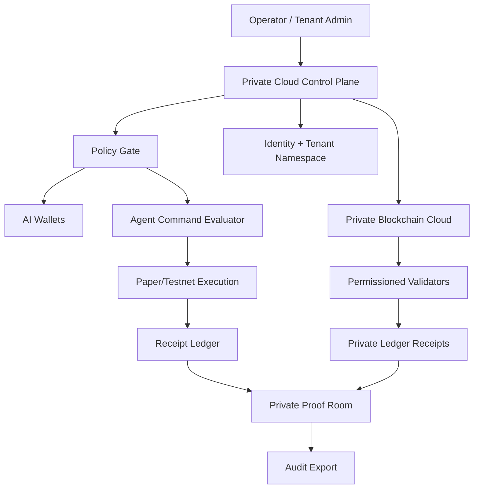

# PARALLAX Private Sovereign Clouds

This document defines the private, sovereign, and enterprise cloud layer for PARALLAX.

The goal is not to claim that PARALLAX is already deployed as a regulated live financial cloud. The goal is to define a mature, policy-gated path for private deployments where AI wallets, paper/testnet ledgers, private proof rooms, receipt ledgers, and private blockchain networks can run under tenant-owned controls.

## Current boundary

PARALLAX remains paper-first and proof-forward.

```text
Allowed now:
- private local/cloud alpha environments
- paper trading
- testnet contracts
- simulated balances
- internal agent credits
- private proof rooms
- receipt-backed audit exports
- private blockchain design/test lanes

Not enabled by this document:
- live broker execution
- custody of real user funds
- fiat/debit on-ramp
- public token sale
- regulated exchange activity
- unreviewed mainnet value bridge
```

## Why private clouds matter

PARALLAX needs more than a public demo path. It needs deployment lanes for teams, enterprises, private research, private validator networks, and future regulated partners.

A private sovereign cloud gives each tenant or operator a controlled environment with:

- isolated namespaces,
- private ledgers,
- private proof rooms,
- policy-gated AI wallets,
- receipt ledger exports,
- optional private blockchain networks,
- private Cloudflare tunnel or equivalent zero-trust ingress,
- operator halt and recovery controls,
- no default exposure of raw backend services.

## Cloud classes

| Cloud | Purpose | Current maturity |
|---|---|---:|
| Local Sovereign Dev Cloud | Local/operator environment for demos, receipts, canisters, and paper loops. | local alpha |
| Team Private Alpha Cloud | Closed team cloud for paper/testnet demos and private proof-room exports. | closed alpha |
| Enterprise Sovereign Cloud | Customer VPC/on-prem/on-prem-adjacent deployment lane. | design gate |
| Private Blockchain Cloud | Permissioned chain lane for PX ledgers, receipts, and validator allowlists. | protocol design |
| Air-Gapped Research Cloud | Offline/private research lane with signed import/export and local receipts. | design gate |

Source of truth:

```text
config/clouds/parallax.private-clouds.json
```

## Private cloud planes



## Required controls

Every private cloud lane must define:

1. Cloud manifest.
2. Tenant manifest.
3. Policy manifest.
4. Ledger manifest.
5. Receipt ledger manifest.
6. Proof room manifest.
7. Operator halt runbook.
8. Backup/restore runbook.
9. Egress policy.
10. Secrets policy.

## Tenant isolation model

Each tenant or private cloud lane receives separate namespaces:

```text
tenant_id
cloud_id
wallet_namespace
ledger_namespace
proof_room_namespace
receipt_namespace
agent_namespace
policy_namespace
```

No private deployment may share proof-room state across tenants unless an explicit shared-audit namespace is created.

## Private blockchain cloud model

A private blockchain cloud is a permissioned execution and receipt environment. It may run private ledgers for:

- PXUSD paper/test units,
- PXAI agent work credits,
- PXGPU compute credits,
- PXCRED receipt credits,
- settlement receipts,
- research mint receipts,
- HFT signal approval receipts.

This is not a public token sale lane.

Validators must be allowlisted. Genesis files, chain configuration, node keys, receipt bridge settings, and export manifests must be stored as proof-room artifacts.

## Ingress and egress

Recommended ingress options:

- Cloudflare Access + Tunnel,
- private VPN,
- VPC private endpoint,
- internal reverse proxy,
- on-prem gateway.

Egress policy should default to deny except:

- approved testnet RPCs,
- approved paper broker/demo endpoints,
- receipt export destinations,
- update channels approved by operator.

## Runtime lanes

| Lane | Execution | Notes |
|---|---|---|
| local | local dev / local canisters | no public exposure |
| paper | simulated balances and orders | default alpha lane |
| testnet | ICP local/test and EVM testnets | no real funds |
| restricted_live_design_only | architecture/design docs only | not executable in alpha |
| live | blocked | requires legal/security/compliance gates |

## Proof-room rule

Every private cloud action that mutates state must emit a receipt.

```text
agent command
  -> policy evaluation
  -> paper/testnet execution
  -> receipt
  -> private proof room
  -> audit export
```

## Operator halt rule

Every private cloud lane must have an operator halt path before it can move from design to alpha.

The halt path must cover:

- agent command intake,
- wallet creation,
- policy evaluation,
- paper/testnet execution,
- private chain bridge,
- receipt export,
- proof-room publication.

## Status

This is a repository-ready architecture and config layer. It does not claim that any private cloud is currently deployed, externally audited, custody-ready, or live-money enabled.
